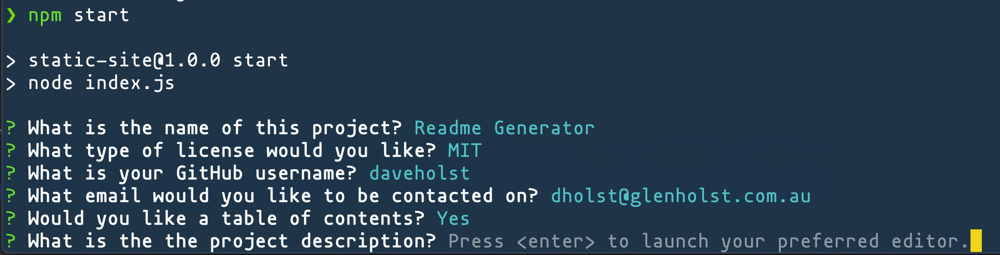

# Readme Generator

This is a program that generates appropriately formatted README.MD files for GitHub repositories. It is built around the inquirer library and takes a series of user inputs from the command line to build the readme file.

This README was generated using the function.

## Table of Contents:

- [License](#License)
- [Installation](#Installation)
- [Usage](#Usage)
- [Tests](#Tests)
- [Contributing](#Contributing)
- [Questions](#Questions)

## License

[](https://opensource.org/licenses/MIT)

This project is licensed under the **MIT License**: https://opensource.org/licenses/MIT

## Screenshots

#### YouTube video demonstrating how to use the application:

[](http://www.youtube.com/watch?v=GSvTLhFcziY)

#### Still Screenshot:



## Installation

The program can be installed using the following steps.

1. Clone the Repo
   Navigate to appropriate directory and clone from GitHub:

```bash
git clone https://github.com/daveholst/readme-generator.git
```

2. Install Dependencies
   Navigate to where the directory has been cloned to:

```bash
cd readme-generator/
npm install
```

## Usage

To use the program simply run the program from your preferred terminal and follow the prompts.

```bash
npm start
```

## Tests

To test that the software is installed and working correctly a test files has been bundled with the program. To invoke the test function type the following into your terminal.

```bash
npm test
```

## Contributing

If you wish to contribute to this project, please open an issue prior to opening a pull request so we may discuss proposed improvements. All suggestions for features encouraged! Simply open an issue on he project.

## Questions

If you have any further questions you can get in contact with the creator through the following methods:

- https://github.com/daveholst/
- dholst@glenholst.com.au
